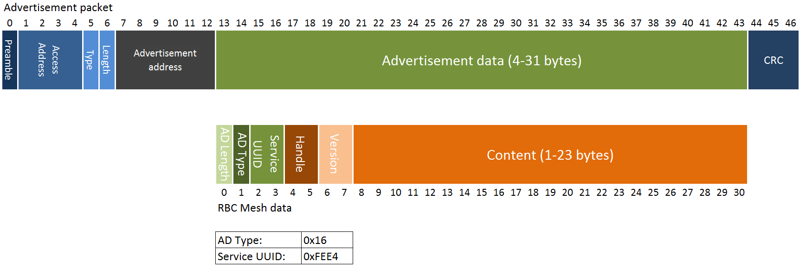

= How it works

== GATT Service
All values are stored as separate characteristics in the Softdevice GATT server. These
characteristics are all contained within one "Mesh" GATT service, along with
one metadata characteristic containing information about the state of the mesh.

The GATT service and characteristics operate with their own 128 bit base UUID,
with the same base.  

.Assigned UUIDs
|===
|Value | UUID 

|Mesh service | 0x2A1E0001-FD51-D882-8BA8-B98C0000CD1E
|Mesh metadata characteristic | 0x2A1E0002-FD51-D882-8BA8-B98C0000CD1E
|Mesh value characteristic | 0x2A1E0003-FD51-D882-8BA8-B98C0000CD1E
|===

=== Mesh values
The Mesh value characteristics are the states that will be shared across the
mesh. Each Mesh value may contain up to 28 bytes of data, and be updated from any
node in the mesh. 

There may be up to 155 "Mesh value" characteristics in the mesh service in each
node, depending on configuration parameters provided to the `rbc_mesh_init()`
function at runtime. Each mesh value will operate with their own instance of
the Trickle algorithm, meaning that they will be rebroadcasted independently.
The handles addressing the values are stored as standard https://developer.bluetooth.org/gatt/Pages/GattNamespaceDescriptors.aspx[Bluetooth SIG
namespace descriptors], where the enumeration of each value is used as
a mesh-global handle.

_NOTE:_ Because the Bluetooth SIG has defined namespace descriptor 0 as
"unknown", the handles start at 1, and trying to access handle 0 returns an
NRF_ERROR_INVALID_ADDR error.

=== Mesh metadata
For ease of use, the service also provides a Metadata characteristic, providing
configuration parameters for the mesh. This meatadata characteristic may be
read by external nodes, and used for configuring new nodes that the user wishes
to add to the mesh. The Metadata characteristic is structured as follows:

[cols="3,1,1,6", options="Header"]
.Metadata Characteristic Structure
|===
|Value | Position | Size | Description

|Access Address | 0 | 4 bytes | The Access address the mesh operates on. 
|Advertisement interval | 4 | 4 bytes | The minimum advertisement interval each value
is broadcasted with in milliseconds.
|Value count | 8 | 1 byte | The amount of available value slots on the node
|Channel | 9 | 1 byte | The BLE channel the mesh operates on
|===

== Trickle Algorithm
The Trickle Algorithm was first presented by P. Levis of Stanford University
and T. Clausen of LIX, Ecole Polytechnique in March 2010, and has since seen
several revisions until it was published as RFC6202 in March 2011. The Trickle
Algorithm provides a method of controlled packet flooding across a mesh of
low-power lossy network nodes, by letting the nodes dynamically decide when to
broadcast their values based on network activity and when the last update to
state values arrived. 

=== A brief overview
The algorithm operate in exponentially growing time intervals of size I, starting at
interval size Imin, growing up to Imax. During an interval, it registers all
incoming messages, where each message may be either consistent or inconsistent
with the nodes current state (the definition of consistency is left for the 
user to decide). For each consistent message, a counter value, C is increased
by one, and for each inconsistent message, if the interval size I is larger
than Imin, the interval timer is reset, and I is set to Imin. At the start of
each interval, a timer T is set for a random time in the range `[I/2, I)`. When
this timer expires, the node shall broadcast its state if the consistent
message counter C is less than some redundancy constant K. At the end of each
interval, the interval length (I) is doubled if `I * 2 < Imax`, and C is reset.

The exponential growth and insconsistency reset functionality allows the nodes
in the network to grow exponentially more silent as the state remains
unchanged, but still stays responsive, as new information arrives. The
consistency counter C and redundancy constant K allows the system to
dynamically adjust to network density, as nodes will choose not to transmit if
they've heard the same message from other nodes several times.

=== Usage in the framework
The framework provides one instance of the Trickle Algorithm for each handle
value pair (dubbed a Trickle instance). This means that when one value is frequently updated, while another
one remains unchanged, the node only rebroadcasts the active value frequently,
keeping the interval times for the static value high. Each handle-value pair
also comes with a version number, which increases by one for each fresh write
to a value. This version number, along with a checksum allows the framework to
distinguish value consistency. If the node recevies a value update with a
higher version number than its own, it will automatically overwrite the
contents of the value data and notify the user. Any inconsistencies to both
version number and checksum results in a reset of interval timing for the value
in question. 

=== Weaknesses in algorithm and implementation
While the algorithm in its intended form provides a rather robust and
effective packet propagation scheme, some necessary adjustments introduces a
few weaknesses. First off, using several instances of the algorithm on the same
set of nodes yields a growth in on-air collisions and poorer frequency
utilization control, as the individual instances take no consideration to
the others' activity. This means that the scheme doesn't scale that well with
several handle value pairs, and the user is asked to consider this during
implementation. The choice of doing separate trickle instances is, however a
result of a tradeoff: If the entire node state shared one trickle instance, the
entire state would be rebroadcasted each time a part of it is updated, 
and the amount of shareable data would be severely limited by packet size and
packet chaining possibilities.

Another weakness in the adaption is caused by the fact that the Softdevice Timeslot API
won't let the framework get free access to the radio at all times, resulting in
a reduced on-air time for mesh related operations. When the
Softdevice operates in an advertising state, this problem only has an impact of
5-25% reduction in potential on-air time for mesh operations, but in a
connected state with a short connection interval, the Softdevice may reduce
timeslots by as much as 80%. This results in a lot of missed packets to the
affected node, and may dramatically increase propagation time to this
node. 

== Timeslots
The framework does all mesh-related transmissions in timeslots granted by the
Softdevice Multiprotocol Timeslot API, operating directly on the radio hardware
module. Timeslots are primarily allocated by extending, short timeslots into
timeslots of upto 1 second, and the framework will attempt to seize the radio 
for as much as the Softdevice will allow. At the beginning of each timeslot, 
the framework samples the RTC0 Low Frequency Timer, and checks whether any 
timers related to the Trickle Algorithm have expired since the end of the 
previous timeslot. If this is the case, the framework does all pending 
operations immediately. After this initial "catch up" operation, the framework 
handles all operations as they appear for the remainder of the timeslot.

For details about the Softdevice Multiprotocol Timeslot API, plese refer to the
Softdevice Specification, available on the Nordic Semiconductor homepage.

== Air interface packets
All Mesh-related packets are broadcasted as regular BLE Nonconnectable
Advertisements, with a few differences: The Access address is set by the user,
and does not have to match the Bluetooth Specification advertisement access
address. In addition, the Advertisement Address (GAP address) field provided after
the packet header, does not necessarily contain the Advertisement Address of
the node broadcasting the message, but rather the address of the mesh node at
which the indicated version of the value-handle pair first appeared. The
packet structure is illustrated below.

== Resource allocation
The framework takes control over several hardware and software resources,
making these unavailable to applications:

* *Timeslot API* All callbacks for timeslot sessions are held by the framework,

* *SWI0_IRQ* The Software interrupt is used for asynchronous packet processing 

* *NRF_TIMER0* HF timer 0 is reset and started by the Timeslot API at the
beginning of each timeslot, and all capture compare slots for this timer may be
in use at any time

* *NRF_RTC0* The Timeslot API uses RTC0 for timing, and manipulating this
module will lead to undefined behavior or hardfaults in the Softdevice.

* *NRF_PPI, channels 8-12* The framework uses PPI channel 8-12 for radio
operation during timeslots, and the Softdevice may use channels 8+ outside them. Only
channels 0-7 are safely available to the application (just as with regular
 Softdevice applications).

In addition, the Softdevice may block some hardware blocks not listed here.
Please refer to the relevant Softdevice Specification for details (available at
the Nordic Semiconductor homepage).

==== Memory
The framework allocates a metadata array on the heap, with 36bytes per
handle-value pair. The rest of the program operates strictly on the stack, and
compiled at Optimization level -O0, Keil reports a program size of approx.
10kB, and stack size of 5.5kB for the Template project under `examples/`.

link:../README.adoc[Back to README]
