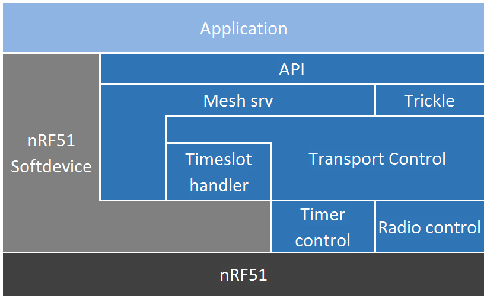

= Structure
The project is split into two parts: _/nRF51/_ and _/application_controller/_. 

The _/nRF51/_ folder contains the main part of the framework (and was the top level 
folder before version 0.6.x), and is meant to run on the nRF51 device-line from 
Nordic Semiconductor. It contains both the framework and example projects
displaying some simple behavior. 

The _/application_controller/_ folder contains a serial interface controller 
framework, that allows external MCUs to take part in the mesh through an
nRF51 device.

== Framework Modules

The framework is split into several separate modules, each of which is
responsible for managing various aspects of the framework.

* *rbc_mesh* The top module of the framework, contains all API functions and is
the only module that should be accessed by the application.

* *mesh_srv* The value storage module, communicates with the Softdevice's GATT
server, and maps all handles to GATT characteristics.

* *timeslot_handler* A module communicating with and abstracting the nRF51
Softdevice Timeslot API and manages the two interrupt contexts the framework
runs in.

* *trickle* Implementation of the IETF RFC6206 "Trickle" algorithm for
mesh-global state propagation.

* *transport_control* Lower level packet handler. Abstracts the radio interface and
packet format for the mesh_srv-module. 

* *radio_control* Asynchronous radio abstraction. Offers a way for higher level
modules to queue radio events and packets, and also provides callbacks on
various radio events.

* *timer_control* Interfaces the NRF_TIMER0 hardware module by managing timer
capture allocations and callbacks. Tightly integrated with the radio module.

== API

The API is exclusively contained in the _rbc_mesh.h_ file in _rbc_mesh/_, and
while the other framework files need to be included in the build process or
Keil project, they should not be interfaced directly. Note that all API
functions except the getters for metadata calls Softdevice SVC functions, and
consequently, all use of the API must happen in interrupt context APP_LOW or MAIN. 
The framework event callback function runs in priority 3 (APP_LOW), and it is
safe to use the API from this context.

=== The API provides the following functions to the user:

*Initialize framework*
[source,c]
----
uint32_t rbc_mesh_init(rbc_mesh_init_params_t init_params);
        
----
This function must be called before any other framework function, and sets up
the Mesh GATT service and enables listening for incoming mesh messages.

The parameters to this function are collected in a struct defined in
_rbc_mesh.h_.

All nodes within the same mesh network must be set up with the same access
address, channel, radio mode and packet configuration, but handle_count and 
adv_int_ms may be different. 

'''

*Manually enable broadcasting of a given value*
[source,c]
----
uint32_t rbc_mesh_value_enable(uint8_t handle);
----
Start broadcasting the indicated value to other nodes, without updating the
contents of the value. If the handle-value pair has never been used before, the
framework forces the node to broadcast an empty version 0-message to
other nodes, which, in turn will answer with their version of the
handle-value-pair. This way, new nodes may get up to date with the rest of the
nodes in the mesh.

'''

*Disable broadcasting of a given value*
[source,c]
----
uint32_t rbc_mesh_value_disable(uint8_t handle);
----
Stop broadcasting the indicated handle-value pair. Note that the framework will
keep updating the local version of the variable when external nodes write to
it, and consequently notify the application about the update as usual. The
framework will not, however, rebroadcast the value to other nodes, but rather
take a passive role in the mesh for this handle-value pair.

'''

*Update value*
[source,c]
----
uint32_t rbc_mesh_value_set(uint8_t handle, uint8_t* data, uint16_t len);
----
Update the value represented by the given handle. This will bump the version
number on the handle-value pair, and broadcast this new version to the rest of
the nodes in the mesh. 

The `data` array may at most be 28 bytes long, and an error will be returned if
the len parameter exceeds this limitation.

'''

*Get value*
[source,c]
----
uint32_t rbc_mesh_value_get(uint8_t handle, 
    uint8_t* data, 
    uint16_t* len,
    ble_gap_addr_t* origin_addr);
----
Returns the most recent value paired with this handle. The `data` buffer must
be at least 28 bytes long in order to ensure memory safe behavior. The actual
length of the data is returned in the `length` parameter. The `origin_addr`
parameter returns the address of the node that first started broadcasting the
current version of the message.

'''

*Get operational access address*
[source,c]
----
uint32_t rbc_mesh_access_address_get(uint32_t* access_address);
----
Returns the access address specified in the initialization function in the
`access_address` parameter.

'''

*Get operational channel*
[source,c]
----
uint32_t rbc_mesh_channel_get(uint8_t* channel);
----
Returns the channel specified in the initialization function in the
`channel` parameter.

'''

*Get handle count*
[source,c]
----
uint32_t rbc_mesh_handle_count_get(uint8_t* handle_count);
----
Returns the handle count specified in the initialization function in the
`handle_count` parameter. 

'''

*Get minimum advertisement interval*
[source,c]
----
uint32_t rbc_mesh_adv_int_get(uint32_t* adv_int_ms);
----
Returns the minimum advertisement interval specified in the initialization
function in the `adv_int_ms` parameter. 

'''

*BLE event handler*
[source,c]
----
uint32_t rbc_mesh_ble_evt_handler(ble_evt_t* evt);
----
Softdevice BLE event handler. Must be called by the application if the
softdevice function `sd_ble_evt_get()` returns a new event. This will update
version numbers and transmit data if any of the value-characteristics in the
mesh service has been written to through an external softdevice connection. May
be omitted if the application never uses any external connections through the
softdevice.

'''

*Softdevice event handler*
[source,c]
----
uint32_t rbc_mesh_sd_irq_handler(void);
----
Handles and consumes any pure softdevice events (excluding softdevice BLE
        events. See the official
        https://devzone.nordicsemi.com/docs/[Softdevice documentation] for
        details). Should be called on each call to `SD_IRQHandler()`.

=== Return values
All API functions return a 32bit status code, as defined by the nRF51 SDK. All 
functions will return `NRF_SUCCESS` upon successful completion, and all
functions except the `rbc_mesh_init()` function return
`NRF_ERROR_INVALID_STATE` if the framework has not been initialized. All
possible return codes for the individual API functions (and their meaning)
are defined in the `rbc_mesh.h` file. 

=== Framework events
In addition to the provided API functions, the framework provides an event
queue for the application. These events are generated in the framework and
should be handled by the application in an implementation of the
`rbc_mesh_event_handler()` function defined in _rbc_mesh.h_. The events come in
the shape of `rbc_mesh_event_t*` structs, with an event type, a handle number,
    a data array and an originator address.

The framework may produce the following events:

* *Update*: The value addressed by the given handle has been updated from an
external node with the given address, and now contains the data array
provided in the event-structure.

* *Conflicting*: A value with the same version number, but different data or
originator has arrived at the node, and this new, conflicting value is provided
within the event-structure. The value is *not* overwritten in the database, but
the application is free to do this with a call to `rbc_mesh_value_set()`.

* *New*: The node has received an update to the indicated handle-value pair,
which was not previously active.

== Examples

The project contains two simple examples and one template project. The two
examples are designed to operate together, and show off an extremely simple
example scenario where two handle-value pairs decides the state of the two LEDs
on the nRF51 evkit (or red and green LED on the nRF51 dongle). The examples
have been tested with boards PCA10000, PCA10001, PCA10031 and PCA10003.

The template provides a basis for implementing your own applications with the
framework, and addresses the different eventhandlers and initialization
functions, without any additional functionality.

=== LED Mesh example
This example reads the buttons on the nRF51 evkit boards, and sets the LEDs
accordingly. It also broadcasts the state of the LEDs to the other nodes in the
same mesh, which will copy the state of the node that registered a button push.
This example can also be flashed to the nRF51 dongles (PCA10000 and PCA10031), 
even though these boards don't have any GPIO actions enabled. The dongle-nodes 
will act as active slaves, copying and rebroadcasting the LED states of other 
nodes.

=== BLE Gateway example
This example uses the same configuration for LEDs as the LED Mesh example, but
provides a S110 Softdevice profile for communication with external nodes in
stead of a physical interface. The example application starts sending
regular connectable BLE advertisements with the Softdevice, and displays the
Mesh service in its GATT server, so that external nodes may write to the two
LED config values as if they were regular characteristics. 

link:../README.adoc[Back to README]
