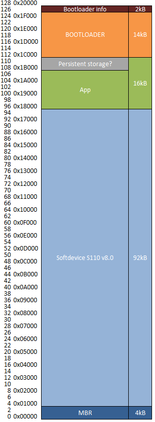

= Bootloader
The mesh-bootloader for over-the-mesh Direct Firmware Updates

The mesh bootloader allows for concurrent transfer of an application, a Softdevice or a new bootloader
across a mesh network. The bootloader does not use the Softdevice for its transfers (but requires
Master boot record, see below). This allows for single-bank Direct Firmware Updates (DFU), which
makes it possible to use the bootloader on devices with 128K of flash.

== Requirements

In addition to requirements stated in the main readme-file:

* nRF5x-Command-Line-Tools version 8.2.0 and above
* Segger Jlink drivers version 5.10n or greater
* link:https://github.com/NordicSemiconductor/pc-nrfutil/tree/mesh_dfu[Prerequisites for pc-nrfutil (mesh_dfu branch)]

For Windows:

* MinGW (any version)
    ** Needed for objcopy.exe in device-page generator
    
For Linux:

* GCC toolchain 4.0.0 and above
** Needed for objcopy utility in device-page generator

== Usage
For a quick-start guide to the Mesh-DFU, see the
link:./dfu_quick_start.adoc[quick start guide document].

The bootloader supports both serial and over the air transfers. The intended main usage scenario
is to have a single device in a network connected to a host over a serial connection, controlled via
the mesh-version of https://github.com/NordicSemiconductor/pc-nrfutil[pc-nrfutil]. From this device,
all devices in the network may receive any firmware updates over the mesh. All update packets are
flooded across the mesh, and all devices in the network are updated at the same time.

The bootloader comes in two flavors: with and without serial transport. The version with the serial
transport works exactly as the over-mesh-only version when not connected to a host, but requires more
flash space. The bootloader is approximately 14kB when compiled with the serial transport in Keil
uVision with -O3 and Cross-Module Optimization, and 12.5kB without it.

It is also possible to start the update from a BLE enabled third-party device (like a smartphone),
not needing the serial connection at all. This can be handy if your network does not have a
designated controller node. Following the documentation provided in the
link:../../docs/dfu/details.adoc[detail document], it is also possible to implement your own
controller application to interface the bootloader.

=== Flashing
In order to enable the first transfers, the bootloader must be flashed onto the device with nrfjprog,
nRFGo Studio or Keil uVision. The bootloader also requires a copy of the Nordic Semiconductor Master
Boot Record, which is included in the Softdevice. The easiest way to acheive this is to flash the
preferred Softdevice onto the device (available on
http://www.nordicsemi.com/eng/Products/Bluetooth-Smart-Bluetooth-low-energy/nRF51822[the Nordic Semiconductor homepage]),
as it contains the MBR. The mesh-framework targets S110 v8.0, and we recommend using this unless
your application has any specific requirements it cannot fulfill.

After you've flashed the Softdevice and bootloader (flash the Softdevice first!), you also have to
flash a device-info page onto the device. The device-info page can be generated by the tool in
link:./pc-util[/pc-util], and gives the bootloader device-specific metadata, allowing it to
make decisions about the validity of incoming DFUs. Without a info-page, the bootloader
will be blind, and refuse to accept any incoming DFUs.

Once you've flashed these three hex-files, the bootloader is ready to accept dfu-transfers.

==== Master Boot Record?
The MBR is a tiny redirection-application, which allows us to put applications anywhere in the
device memory area. By default, the nRF51 assumes that every application starts at address zero, and
that every interrupt handler exists at a set memory address right in the beginning of the memory
area. Since we've already flashed the Softdevice to the beginning of the memory area, but want the
interrupts to be handled by our application or bootloader (depending of which mode we're in), we need
the MBR to catch the interrupts and resets, and send the program execution to the right handlers
in the application or bootloader.

==== UICR.BOOTLOADERADDR
The nRF51 chip contains a register called UICR.BOOTLOADERADDRESS, which must be flashed with the
start address of the bootloader, in order for the Master Boot Record to recognize it. The bootloader
handles this in the beginning of link:main.c[main.c], by forcing the location of the vector table
into the address representing the register.

Once set, the bootloader address register cannot be changed without erasing the entire memory area of the
device. This has two major implications:

1. Each time you want to change where the bootloader is located, you have to
erase everything on the chip (including the MBR and Softdevice), and reflash it. The bootloader will
not be able to do this at run-time, so make sure you set off enough space for the bootloader.

2. nRFgo Studio will protest if you attempt to program the bootloader a second time, as it's unable to
erase the register memory address without erasing everything. When nRFgo studio encounters an error
like this, it aborts the entire transfer. You either have to do "erase all" and reflash the
Softdevice and device page each time you want to reflash your bootloader, or use nrfjprog, which only
issues a warning of the potential invalid register.

Also note that Keil isn't able to flash the register address, due to missing algorithms. This means
that the first time you flash the bootloader, you have to use an external tool. However, once the
register is set, Keil may flash the actual code area at any time.

== DFU Signing

The mesh-bootloader allows for signed DFU transfers. Signing DFUs prevents attackers from hijacking
a device by flashing their own firmware to it. While not enforced, we strongly recommend giving
your device a signing key before deploying a product, as this allows for better security, without any
significant overhead.

The DFU transfers are signed by a private key, generated by the Nordic Semiconductor pc-nrfutil tool,
and each device has a copy of the public key to verify a signature added to the end of signed firmwares.
Under no circumstance should the private signing key be shared with a third party or be present in
the device firmware. The public key may safely be shared or visible to third parties.
You may choose to use a single signing key for each application, or use the
same key for all applications.

Signing is acheived through https://github.com/kmackay/micro-ecc[a third-party
implementation by Ken MacKay] of the Elliptic Curve Digital Signature Algorithm (ECDSA). A stripped
version of his uECC module is present in /nRF51/bootloader/, along with its license file.

== Limitations and future features
A couple of limitations to the bootloader applies:

- To update the bootloader, it has to allocate some space in the application section for double
banking the firmware, as it cannot overwrite itself while operational. The bootloader will use the
end of the application area to achieve this, meaning that any application data present in that area
will be invalidated. The application has to be retransfered afterwards to repair itself.

- The bootloader is not able to host a DFU transfer on its own. This is a planned feature, which
allows devices to adopt newer versions of their firmware from their neighbors.

- The bootloader cannot validate incoming transfers before they receive every segment of the
firmware. This issue is hard to solve, as the packets in the transfer are unencrypted, and
will be prone to injection attacks, rendering any pre-validation useless. For the same reason, it is
strongly recommended to NOT send any sensitive data as part of the DFU transfer, including private
encryption/signing keys and passwords. This means that these data-segments cannot be stored as part
of a firmware-file.

- Currently, there is no way to change the device-info page during run-time. This feature is
scheduled for a future update, and will allow changing of application start-address, public signing
keys and application IDs. Traces of this feature may be present in the current source code and
documentation, labeled as a "BL info" dfu_type.

As the bootloader is able to do a self-update, you may safely deploy with the current bootloader,
and do a DFU of a bootloader with new features once they are released, given that you've allocated
enough space for these features. It is recommended to allocate at least 16kB for the bootloader, or
up to 32kB if flash size is not an issue. The bootloader is not expected to grow beyond 20kB, but
this cannot be guaranteed.

== Memory map
Below is a memory map of the device flash area with the bootloader on a 128kB device, with S110
v8.0. Note the device info page at the top with its bank page below it. The bank page is used to
ensure that the contents of the device-info page is never lost due to power-outs or similar.

== Tell me more!
For more information about the mesh-dfu functionality and how it's implemented in the bootloader,
take a look at the link:../../docs/dfu/details.adoc[detail document] under /docs/dfu/.
